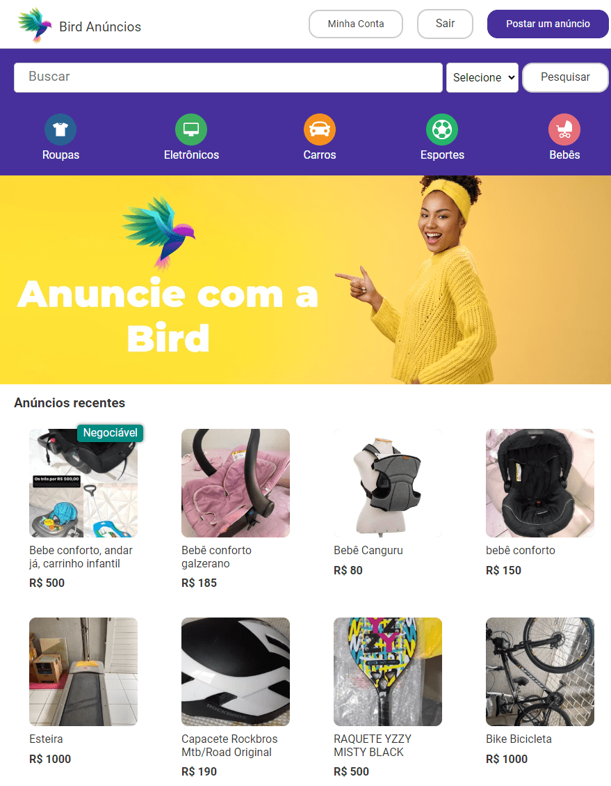
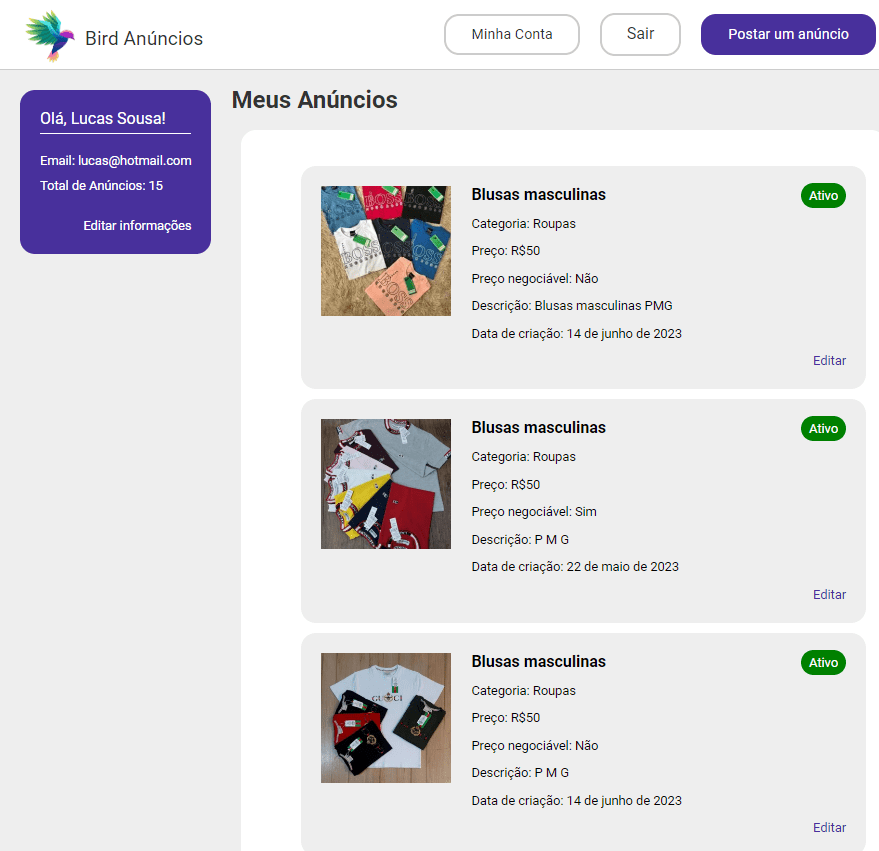
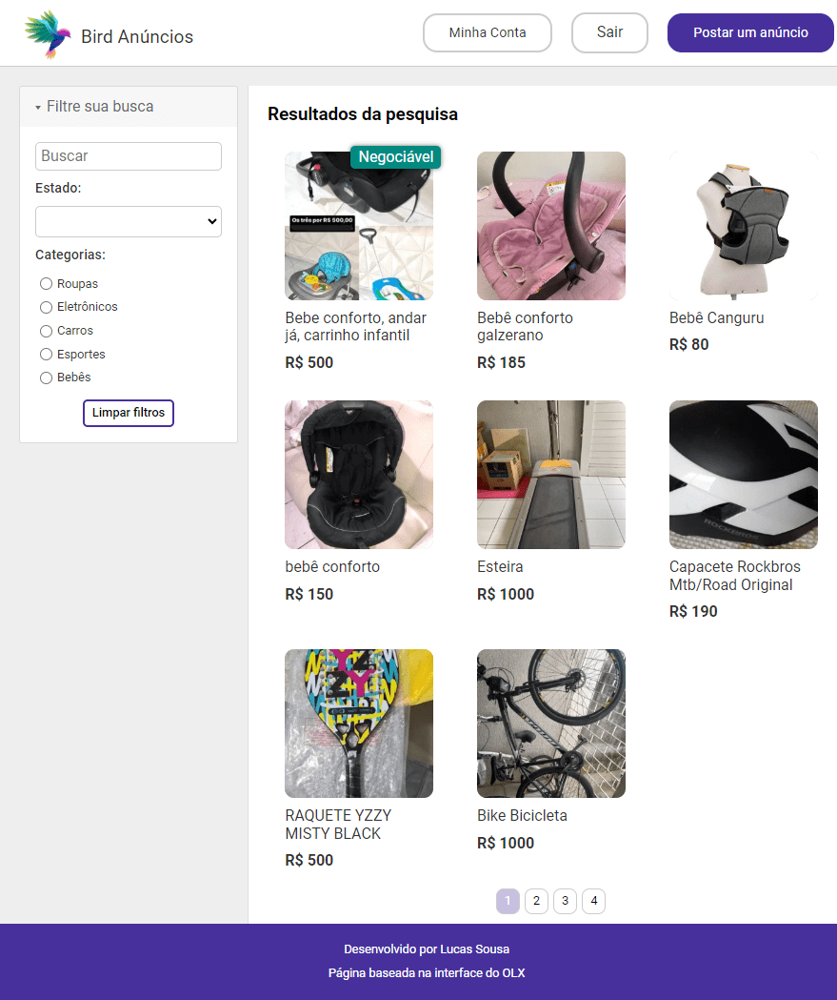

# Bird Anúncios

O Bird Anúncios é uma aplicação para publicar anúncios de algum produto. O Bird é uma aplicação inspirada na OLX.


## Stack utilizada

**Front-end:** React, TypeScript, ContexAPI, StyledComponent, Axios, Reack Hook Form, React Router, Zod.

Outras bibliotecas utilizadas: Js-Cookie, Qs, React Toastify, React Text Mask, React Media, React Modal.

**Back-end:** Utilizado a api desenvolvida pela B7web em Node e Express


## Demonstração

<p align="center">
   
</p>


## Acessando o projeto

O projeto está disponível através dos links:

[bird-ads.vercel.app](bird-ads.vercel.app)  
[bird-ads-lucassousal.vercel.app](bird-ads-lucassousal.vercel.app)

## Instalando o projeto

```bash
  npm instal
  npm run dev
```


## Variáveis de Ambiente

Para rodar esse projeto, você vai precisar adicionar as seguintes variáveis de ambiente no seu .env

`VITE_REACT_API_URL`


## Funcionalidades

- Visualizar últimos anúncios
- Pesquisar anúnicos
- Criar conta
- Criar anúncios
- Editar anúncios
- Inativar anúncios


## Aprendizados

Durante a realização deste projeto de construção de um Front End do zero, tive a oportunidade de aprimorar minhas habilidades ao trabalhar com várias bibliotecas com as quais eu não havia trabalhado anteriormente. Algumas delas incluem o React Hook Form, Zod e Js-Cookie.

Um dos maiores desafios enfrentados durante o desenvolvimento do projeto foi lidar com uma API que não possuía documentação sobre as entradas e retornos esperados. Para contornar essa situação, foi necessário analisar o código-fonte da própria API para obter as informações necessárias. Além disso, otimizar o código para reduzir as chamadas à API também foi um desafio importante, e para solucioná-lo, optei por utilizar a ContextAPI.

Essas experiências me proporcionaram valiosos aprendizados, como a capacidade de lidar com bibliotecas desconhecidas e aprimorar minha habilidade de analisar e compreender APIs sem uma documentação clara. Além disso, aprendi a importância da otimização do código para melhorar o desempenho e a eficiência do projeto. Esses conhecimentos adquiridos certamente serão aplicados em futuros projetos de Front End, contribuindo para meu crescimento profissional.

## Screenshots

<p align="center">
   
</p>
 

<p align="center">
   
</p>


<p align="center">
   
</p>
 
